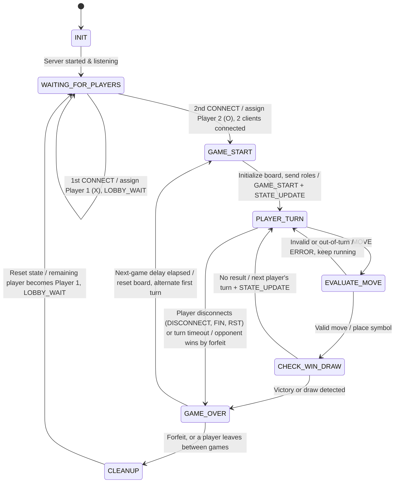
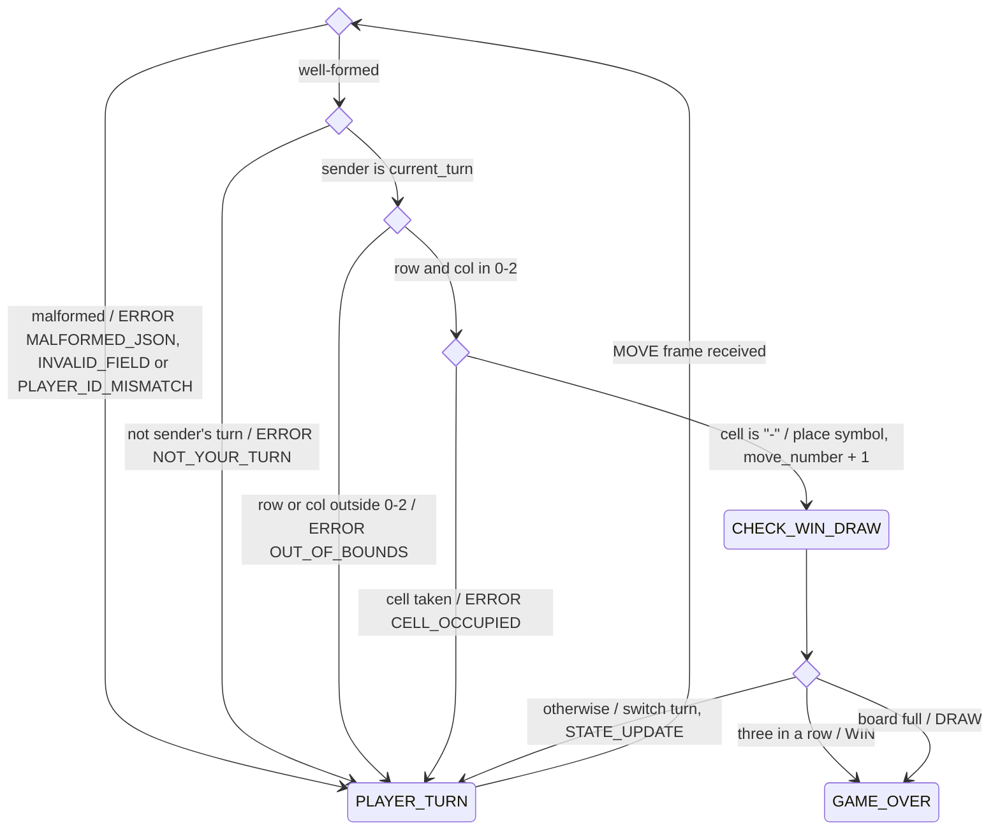
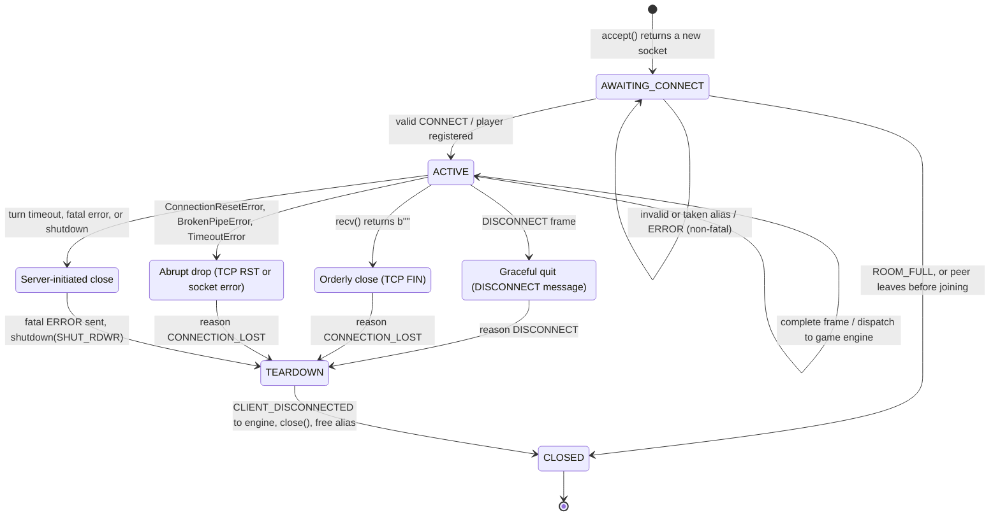

# Tic-Tac-Toe Game State Machine (FSM) Specification

| | |
|---|---|
| **Project** | CS 457 Networked Tic-Tac-Toe |
| **Author** | Evan Lira |
| **Spec version** | 1.0 (implements protocol version 1.2) |
| **Last updated** | 2026-10-04 |
| **Companion documents** | [`protocol_blueprint.md`](protocol_blueprint.md) (messages, framing, error codes) · [`ai_prompts.md`](ai_prompts.md) (AI constraint strategy) |

This document specifies the **server-side game engine**: every state, every transition, how player moves (valid and invalid) are handled, and how the engine reacts when a connection ends gracefully or abruptly. Message formats are defined in the protocol blueprint. Section references written as **B§n** point to [`protocol_blueprint.md`](protocol_blueprint.md).

---

## Contents

1. [Engine Model](#1-engine-model)
2. [Game Engine State Diagram](#2-game-engine-state-diagram)
3. [State Handling Logic](#3-state-handling-logic)
4. [Handling Player Moves](#4-handling-player-moves)
5. [Connection Termination & Socket Lifecycle](#5-connection-termination--socket-lifecycle)
6. [Run-to-Completion Rules & Race Conditions](#6-run-to-completion-rules--race-conditions)
7. [Revision History](#7-revision-history)

### Sprint 1 Requirements Traceability

| Requirement | Where it is met |
|---|---|
| **2.3** Server-side state engine with explicit state transitions | [§2](#2-game-engine-state-diagram) (diagram), [§2.2](#22-state-transition-table) (transition table), [§3](#3-state-handling-logic) (per-state logic) |
| **2.3** Diagrams in Mermaid `stateDiagram-v2`, embedded in Markdown | [§2.1](#21-diagram), [§4.1](#41-move-evaluation-diagram), [§5.4](#54-socket-lifecycle-diagram) |
| Valid moves | [§4.2](#42-valid-moves) |
| Invalid moves | [§4.3](#43-invalid-moves) |
| Unexpected client disconnections (abrupt and orderly) | [§5](#5-connection-termination--socket-lifecycle) |
| **2.4.1** Application `DISCONNECT` vs. TCP FIN vs. TCP RST / hard drops | [§5.1](#51-how-a-connection-can-end) |
| **2.4.2** TCP EOF (0-byte) rule | [§5.2](#52-the-tcp-eof-0-byte-rule) |
| **2.4.3** Socket exceptions during network drops | [§5.3](#53-socket-exceptions) |
| Socket lifecycle management | [§5.4](#54-socket-lifecycle-diagram), [§5.5](#55-reference-session-loop-python) |

---

## 1. Engine Model

The server runs **one game room** with two player slots. The room is a single finite state machine (the *game engine*). Each client connection also has a small *socket lifecycle* (§5.4) that turns network activity into engine events.

### 1.1 States

| State | Kind | Meaning |
|---|---|---|
| `INIT` | Transient | Server process starting: bind and listen |
| `WAITING_FOR_PLAYERS` | **Waiting** | 0 or 1 registered players; waiting for the room to fill |
| `GAME_START` | Transient | Initialize the board, assign roles and first turn, announce the game |
| `PLAYER_TURN` | **Waiting** | A game is running; waiting for the active player's `MOVE` |
| `EVALUATE_MOVE` | Transient | Validate a received `MOVE` |
| `CHECK_WIN_DRAW` | Transient | Apply rules after an accepted move: win, draw, or next turn |
| `GAME_OVER` | **Waiting** | Game finished; final results broadcast; waiting out the next-game delay |
| `CLEANUP` | Transient | A player left: reset the match and return any remaining player to the lobby |

The engine only waits in the three **waiting** states, so events can only arrive there. Transient states finish their actions and move on immediately, inside the same event (§6).

### 1.2 Events

| Event | Source |
|---|---|
| `CONNECT(P)` | A valid frame with `msg_type` `CONNECT` from socket P |
| `MOVE(P, row, col)` | A frame with `msg_type` `MOVE` from registered player P |
| `CLIENT_DISCONNECTED(P, reason)` | P's socket lifecycle (§5): a `DISCONNECT` message, EOF, a socket exception, or a fatal protocol error. `reason` is `DISCONNECT`, `CONNECTION_LOST`, or `TIMEOUT`. |
| `TURN_TIMEOUT` | The turn timer (`TURN_TIMEOUT_S`, B§7.4) |
| `NEXT_GAME_TIMER` | The next-game timer (`NEXT_GAME_DELAY_S`, B§7.4) |
| `SHUTDOWN` | Server operator (Ctrl-C / SIGTERM) |

### 1.3 Room Data

The extended state that transitions read and write:

| Variable | Type | Initial value |
|---|---|---|
| `players` | `{"PLAYER_1": Player or None, "PLAYER_2": Player or None}`, where a Player is `{player_id, symbol, sock}` | both `None` |
| `board` | 3×3 of `"X"`, `"O"`, `"-"` | all `"-"` |
| `current_turn` | `PlayerId` or `None` | `None` |
| `first_turn` | `PlayerId` or `None` | `None` |
| `move_number` | `int` 0–9 | `0` |
| `game_number` | `int` | `0` (no game played yet in this match) |
| `scores` | `{PlayerId: int}` | `{}` |
| `draws` | `int` | `0` |
| `last_result` | `"WIN"`, `"DRAW"`, `"FORFEIT"`, or `None` | `None` |
| `turn_timer`, `next_game_timer` | timer handle or `None` | `None` |

In the tables below, **P** is the player who caused the event and **Q** is the opponent.

---

## 2. Game Engine State Diagram

### 2.1 Diagram

The layout follows the course's example FSM. It adds `CHECK_WIN_DRAW` (from the SOW), automatic next games, forfeits, and disconnect handling.



**Reading the diagram:**
- Labels use the form *event / action*.
- In `GAME_OVER` the server broadcasts the final results (B§4.8). After a win or draw, it waits `NEXT_GAME_DELAY_S` (5 s) and starts the next game with the first turn alternated. After a forfeit, it goes straight to `CLEANUP`.
- **Disconnects can happen in every waiting state.** In `WAITING_FOR_PLAYERS` the slot is simply freed (T4). In `PLAYER_TURN` it is a forfeit (T12, T13). In `GAME_OVER` the next game is canceled (T16). §5 explains how each kind of disconnect is detected.
- Server shutdown can happen in any waiting state (T21). It is left out of the diagram to keep it readable.

### 2.2 State Transition Table

This is the normative definition. The server implements exactly these transitions and no others.

| # | From | Event | Guard | Actions | To |
|---|---|---|---|---|---|
| T1 | `INIT` | Server started | Listening socket bound on `DEFAULT_PORT` | Reset room data (§1.3) | `WAITING_FOR_PLAYERS` |
| T2 | `WAITING_FOR_PLAYERS` | `CONNECT(P)` | Room empty; alias valid | Register P as `PLAYER_1` (`X`). `LOBBY_WAIT` → P. | `WAITING_FOR_PLAYERS` |
| T3 | `WAITING_FOR_PLAYERS` | `CONNECT(P)` | One player waiting; alias valid and not taken | Register P as `PLAYER_2` (`O`). | `GAME_START` |
| T4 | `WAITING_FOR_PLAYERS` | `CLIENT_DISCONNECTED(P)` | P is the waiting player | Free P's slot and alias. | `WAITING_FOR_PLAYERS` |
| T5 | `GAME_START` | *(entry)* | — | See §3.3: set `game_number`, `first_turn`, `board`, `current_turn`. `GAME_START` → each player, then `STATE_UPDATE` → both. Start `turn_timer`. | `PLAYER_TURN` |
| T6 | `PLAYER_TURN` | `MOVE(P)` | — | Hand the move to validation (§4). | `EVALUATE_MOVE` |
| T7 | `EVALUATE_MOVE` | *(entry)* | Any check in B§5.2 fails | `ERROR` (non-fatal) → P. Board, turn, and `turn_timer` unchanged. | `PLAYER_TURN` |
| T8 | `EVALUATE_MOVE` | *(entry)* | All checks pass | `board[row][col]` = P's symbol. `move_number` += 1. | `CHECK_WIN_DRAW` |
| T9 | `CHECK_WIN_DRAW` | *(entry)* | No three-in-a-row; `move_number` < 9 | `current_turn` = Q. Restart `turn_timer`. `STATE_UPDATE` → both. | `PLAYER_TURN` |
| T10 | `CHECK_WIN_DRAW` | *(entry)* | P has three in a row | `scores[P]` += 1. `last_result` = `WIN`. | `GAME_OVER` |
| T11 | `CHECK_WIN_DRAW` | *(entry)* | No three-in-a-row; `move_number` = 9 | `draws` += 1. `last_result` = `DRAW`. | `GAME_OVER` |
| T12 | `PLAYER_TURN` | `CLIENT_DISCONNECTED(P, reason)` | Either player's turn | Free P's slot. `scores[Q]` += 1. `last_result` = `FORFEIT`, with `forfeit_reason` = `reason`. | `GAME_OVER` |
| T13 | `PLAYER_TURN` | `TURN_TIMEOUT` | — | `ERROR TURN_TIMEOUT` (fatal) → active player P, then tear down P's socket (§5.4). Free P's slot. `scores[Q]` += 1. `last_result` = `FORFEIT`, with `forfeit_reason` = `TIMEOUT`. | `GAME_OVER` |
| T14 | `GAME_OVER` | *(entry)* | `last_result` is `FORFEIT` | Stop `turn_timer`. `GAME_OVER` (`FORFEIT`, `next_game_in_s: null`) → Q. | `CLEANUP` |
| T15 | `GAME_OVER` | *(entry)* | `last_result` is `WIN` or `DRAW` | Stop `turn_timer`. `current_turn` = `None`. `STATE_UPDATE` → both, then `GAME_OVER` (`next_game_in_s` = 5) → both. Start `next_game_timer`. | `GAME_OVER` (waits) |
| T16 | `GAME_OVER` | `CLIENT_DISCONNECTED(P)` | Waiting for next game | Cancel `next_game_timer`. Free P's slot. Not a forfeit; scores unchanged. | `CLEANUP` |
| T17 | `GAME_OVER` | `NEXT_GAME_TIMER` | Both players still registered | — | `GAME_START` |
| T18 | `CLEANUP` | *(entry)* | Q still registered | Reset match: `scores` = `{Q: 0}`, `draws` = 0, `game_number` = 0. Q becomes `PLAYER_1` (`X`). `LOBBY_WAIT` → Q. | `WAITING_FOR_PLAYERS` |
| T19 | `CLEANUP` | *(entry)* | No players left | Reset room data. | `WAITING_FOR_PLAYERS` |
| T20 | any waiting state | `CONNECT` from a new socket | Alias invalid or taken, or room full | `ERROR INVALID_NAME` / `NAME_TAKEN` (non-fatal), or `ROOM_FULL` (fatal, then close that socket). Room state is unchanged. | *(unchanged)* |
| T21 | any waiting state | `SHUTDOWN` | — | Cancel timers. `ERROR SERVER_SHUTDOWN` (fatal) → every registered player. Tear down all sockets and the listening socket. | *(terminated)* |

Messages that are valid but not allowed in the current state (e.g. `MOVE` while in `WAITING_FOR_PLAYERS`) get `ERROR UNEXPECTED_MESSAGE` and cause no transition (B§6.2).

---

## 3. State Handling Logic

### 3.1 `INIT`

- **Entry:** create a TCP socket, set `SO_REUSEADDR` (so a restarted server can rebind right away), `bind(("0.0.0.0", DEFAULT_PORT))`, `listen()`, and reset room data.
- **Exit:** T1 → `WAITING_FOR_PLAYERS`. If `bind()` fails (e.g. the port is in use), log the error and exit the process. No client exists yet, so no protocol messages are involved.

### 3.2 `WAITING_FOR_PLAYERS`

- **Holds:** 0 or 1 registered players.
- **Handles:** `CONNECT` (T2, T3, T20), `CLIENT_DISCONNECTED` of the waiting player (T4), `SHUTDOWN` (T21).
- **Rejects:** `MOVE` → `ERROR UNEXPECTED_MESSAGE`.
- **Known limit:** if the waiting player's host vanishes without FIN or RST, the server cannot tell yet. It is detected once the game starts, by the turn timer or a failed send (§5.1).

### 3.3 `GAME_START` (transient)

Entry actions, in order:
1. If `game_number` is 0 (new match): `game_number` = 1, `first_turn` = random choice of the two aliases, `scores` = `{P1: 0, P2: 0}`.
   Otherwise: `game_number` += 1 and `first_turn` = the player who did **not** move first last game.
2. `board` = all `"-"`, `move_number` = 0, `current_turn` = `first_turn`, `last_result` = `None`.
3. Send `GAME_START` to each player with its own `your_role`, then send `STATE_UPDATE` to both (B§6.3 rule 1).
4. Start `turn_timer`.

Exit: T5 → `PLAYER_TURN`.

### 3.4 `PLAYER_TURN`

- **Holds:** a running game. `current_turn` names the active player, and `turn_timer` is running.
- **Handles:** `MOVE` from **either** player (T6; an out-of-turn move is rejected in `EVALUATE_MOVE`), `CLIENT_DISCONNECTED` from either player (T12), `TURN_TIMEOUT` (T13), `SHUTDOWN` (T21).
- **Rejects:** `CONNECT` from a registered socket → `UNEXPECTED_MESSAGE`. `CONNECT` from a new socket → `ROOM_FULL` (T20).

### 3.5 `EVALUATE_MOVE` (transient)

Runs the validation pipeline (§4.1, B§5.2). Exit: T7 (invalid) → `PLAYER_TURN`, or T8 (valid) → `CHECK_WIN_DRAW`.

### 3.6 `CHECK_WIN_DRAW` (transient)

Checks the eight lines in a fixed order: rows 0→2, columns 0→2, main diagonal, anti-diagonal. The first complete line of P's symbol is the `winning_line`. Exit: T9 (no result), T10 (win), or T11 (draw). A win is checked **before** a draw, so a ninth move that completes a line is a win.

### 3.7 `GAME_OVER`

- **Entry:** T14 (forfeit: notify Q, then go straight on to `CLEANUP`) or T15 (win or draw: broadcast the final `STATE_UPDATE` and `GAME_OVER`, start `next_game_timer`, and wait).
- **Handles while waiting:** `NEXT_GAME_TIMER` (T17), `CLIENT_DISCONNECTED` (T16), `SHUTDOWN` (T21).
- **Rejects:** `MOVE` → `UNEXPECTED_MESSAGE`. The board is final.

### 3.8 `CLEANUP` (transient)

Resets the match, keeps any remaining player as the new `PLAYER_1`, and sends that player `LOBBY_WAIT` (T18 or T19). Sockets of departed players are already closed by their lifecycle (§5.4). `CLEANUP` only resets room data.

---

## 4. Handling Player Moves

### 4.1 Move Evaluation Diagram

Expands `EVALUATE_MOVE` and `CHECK_WIN_DRAW` from §2.1. Each diamond is one check from B§5.2, in order.



### 4.2 Valid Moves

A move is valid when it passes every check: it is well formed, comes from `current_turn`, has `row` and `col` in 0–2, and targets a `"-"` cell. The engine then does the following, all within one event:

1. Places the sender's symbol and increments `move_number` (T8).
2. Checks for a win, then for a draw (T10, T11).
3. If the game continues: switches `current_turn` to the opponent, **restarts** the turn timer, and broadcasts `STATE_UPDATE` (T9).
4. If the game ended: broadcasts the final `STATE_UPDATE` (`current_turn: null`) followed by `GAME_OVER` (T15).

Example on the wire: the full game in B§8.5.

### 4.3 Invalid Moves

An invalid move **never** changes the room state and **never ends the session loop or crashes the server**. The sender gets one non-fatal `ERROR`, the loop goes on reading frames, and the sender stays the active player (if they were). The turn timer is **not** reset, so a client cannot stall the game by sending bad moves.

| Invalid move | Detected at | `ERROR` code | Effect |
|---|---|---|---|
| Not valid JSON / truncated line | Parse | `MALFORMED_JSON` | Frame ignored; stream stays in sync (B§2.4) |
| `row`/`col` missing or not an integer (e.g. `"1"`, `true`) | Schema check | `INVALID_FIELD` | Ignored |
| `player_id` is not the sender's registered alias | Identity check | `PLAYER_ID_MISMATCH` | Ignored. Prevents moving for the opponent. |
| `MOVE` while no game is running (`WAITING_FOR_PLAYERS`, `GAME_OVER`) | State check | `UNEXPECTED_MESSAGE` | Ignored |
| From the player who is not `current_turn` | Turn check | `NOT_YOUR_TURN` | Ignored |
| `row` or `col` outside 0–2 | Bounds check | `OUT_OF_BOUNDS` | Ignored; still the sender's turn |
| Target cell is `"X"` or `"O"` | Occupancy check | `CELL_OCCUPIED` | Ignored; still the sender's turn |

Examples of each on the wire: B§8.6.

---

## 5. Connection Termination & Socket Lifecycle

### 5.1 How a Connection Can End

| How it ends | What happens on the wire | How the server detects it | Engine event |
|---|---|---|---|
| **Application-layer disconnect**: player types `quit` / Ctrl-C | Client sends `DISCONNECT`, then `close()` (FIN) | A complete `DISCONNECT` frame is dispatched | `CLIENT_DISCONNECTED(P, DISCONNECT)` |
| **Transport-layer teardown**: client process exits or calls `close()` without sending `DISCONNECT` | TCP FIN (4-way close) | `recv()` returns `b""` (EOF, §5.2) | `CLIENT_DISCONNECTED(P, CONNECTION_LOST)` |
| **Abrupt termination**: client killed (`kill -9`) or crashes with unread data | The client's kernel still closes the socket: FIN, or RST if unread data was queued | `recv()` returns `b""`, or raises `ConnectionResetError` (§5.3) | `CLIENT_DISCONNECTED(P, CONNECTION_LOST)` |
| **Hard drop**: CML node powered off, router link cut, cable pulled | **Nothing is sent.** No FIN and no RST reach the server. | The turn timer (`TURN_TIMEOUT_S`). Later, a send may fail with `BrokenPipeError`, `ConnectionResetError`, or `TimeoutError` once TCP retransmissions give up. | `TURN_TIMEOUT` → T13, or `CLIENT_DISCONNECTED(P, CONNECTION_LOST)` |
| **Server-initiated**: fatal protocol error, turn timeout, shutdown | Server sends a fatal `ERROR`, then `shutdown(SHUT_RDWR)` (FIN) | The server decides it | T13, T21, or `CLIENT_DISCONNECTED(P, CONNECTION_LOST)` |

A killed process (`kill -9`) and a hard drop behave differently. When a process is killed, the client's operating system is still running and closes the socket for it, so the server sees FIN or RST right away. When a host loses power or its link is cut, nothing at all reaches the server. A blocked `recv()` would wait forever, which is why the engine has an application-level turn timer (B§7.4).

### 5.2 The TCP EOF (0-Byte) Rule

When the peer closes its side cleanly, `recv()` does **not** raise an exception. It returns `b""` (EOF), the POSIX signal that the peer will send nothing more. Every receive loop in this project follows these rules:

1. **Check for EOF on every `recv()`:** `if not data: break`. A loop that skips this check spins forever at 100% CPU, because every later `recv()` returns `b""` immediately.
2. **Discard any partial frame** still in the `FrameReader` buffer. Bytes without a terminating `\n` are never processed (B§2.4 rule 7).
3. **Raise exactly one `CLIENT_DISCONNECTED` event**, then `close()` the socket (the `finally:` block in §5.5).

The client applies the same rule to the server's socket: on EOF it prints "Connection to server lost" and exits (B§7.6).

### 5.3 Socket Exceptions

Network failures appear as exceptions from `recv()`, `send()`, or `sendall()`. Every dispatch loop catches them so the server never crashes and the engine is always told:

| Exception | Cause | Handling |
|---|---|---|
| `ConnectionResetError` | Peer sent TCP RST (crashed, or closed with unread data) | `CLIENT_DISCONNECTED(P, CONNECTION_LOST)` |
| `BrokenPipeError` | Writing to a socket whose peer already closed (EPIPE) | Same. Python ignores `SIGPIPE`, so this arrives as an exception instead of killing the process. |
| `ConnectionAbortedError` | Connection aborted by the local stack | Same |
| `TimeoutError` | A configured socket timeout expired, or TCP retransmissions gave up (`ETIMEDOUT`) | Same. No timeout is set on the blocking `recv()`, because a player legitimately stays silent while the opponent thinks. Silent peers are handled by the turn timer instead. |
| Other `OSError` (e.g. `EHOSTUNREACH`) | Any other socket-level failure | Same |
| `FrameTooLarge` | 4096 bytes received without a `\n` (B§2.4 rule 6) | Fatal `ERROR FRAME_TOO_LARGE` → P, then `CLIENT_DISCONNECTED(P, CONNECTION_LOST)` |

**Failures while sending.** A broadcast can fail on Q's socket in the middle of a transition (e.g. Q vanished). The send helper catches the exception, marks Q as dead, and the engine processes `CLIENT_DISCONNECTED(Q, CONNECTION_LOST)` **after** the current transition finishes (§6). A failed send never interrupts a transition halfway.

### 5.4 Socket Lifecycle Diagram

Each accepted connection follows this lifecycle. It is the bridge between raw socket activity and engine events. The four middle states correspond to the four ways a registered player's connection can end (§5.1).



| Lifecycle state | Meaning |
|---|---|
| `AWAITING_CONNECT` | Socket accepted, not yet a player. Only `CONNECT` or `DISCONNECT` is accepted. |
| `ACTIVE` | Registered player. Complete frames are dispatched to the game engine. |
| Graceful quit | Application-layer disconnect: the client said goodbye with `DISCONNECT`. |
| Orderly close | Transport-layer teardown: `recv()` returned `b""` after the peer's FIN (§5.2). |
| Abrupt drop | RST or a socket exception from `recv()` / `sendall()` (§5.3). |
| Server-initiated close | The server ends the connection: it sends a fatal `ERROR`, then `shutdown(SHUT_RDWR)`. |
| `TEARDOWN` | Runs exactly once, whatever the cause: notify the engine, close the socket, free the alias. |
| `CLOSED` | Socket closed; the reader thread or handler exits. |

**Server-initiated teardown** (turn timeout, fatal error, shutdown) sends the fatal `ERROR` and then calls `sock.shutdown(socket.SHUT_RDWR)`. This sends FIN *after* the `ERROR`, so the client can still read it, and it makes the session's blocked `recv()` return `b""`. The session loop then runs its normal EOF cleanup and `close()`. Nothing else closes a socket that another thread is reading.

### 5.5 Reference Session Loop (Python)

This combines framing (B§2.6), the EOF rule (§5.2), and exception handling (§5.3). It is the only place a client socket is read and closed.

```python
import logging
import socket

from framing import FrameReader, FrameTooLarge   # blueprint §2.6

logger = logging.getLogger("server")


def client_session(sock: socket.socket, room) -> None:
    """Socket lifecycle for one client (§5.4): read frames, feed the FSM, clean up once."""
    reader = FrameReader()
    reason = "CONNECTION_LOST"                    # default for EOF, RST, and socket errors
    try:
        while True:
            data = sock.recv(4096)
            if not data:                          # EOF rule: b"" means the peer sent FIN
                logger.info("EOF from %s", room.alias_of(sock))
                break                             # never keep looping on b"" (100% CPU)
            for line in reader.feed(data):        # 0, 1, or many frames per recv() (blueprint §2.2)
                if room.dispatch(sock, line) == "QUIT":   # client sent DISCONNECT
                    reason = "DISCONNECT"
                    return
    except FrameTooLarge:
        room.send_fatal_error(sock, "FRAME_TOO_LARGE")
    except (ConnectionResetError, BrokenPipeError, ConnectionAbortedError, TimeoutError) as e:
        logger.warning("Connection to %s lost abruptly: %r", room.alias_of(sock), e)
    except OSError as e:                          # any other socket-level failure
        logger.warning("Socket error from %s: %r", room.alias_of(sock), e)
    finally:
        room.client_disconnected(sock, reason)    # FSM event CLIENT_DISCONNECTED; no-op if repeated
        sock.close()
```

`room.client_disconnected()` is **idempotent**. After a turn timeout (T13) the engine has already removed P, so the call that the session loop makes after `shutdown(SHUT_RDWR)` wakes it does nothing.

This loop was tested against: a FIN after a partial frame (the complete frame is processed and the partial one is dropped), a `DISCONNECT` message, an oversized frame, a real TCP RST (`SO_LINGER` 0), and a server-side `shutdown(SHUT_RDWR)` (the reader wakes, and the client still receives the final `ERROR` before EOF).

### 5.6 Disconnect Outcomes by State

| Engine state when P leaves | Transition | What Q receives | Scores |
|---|---|---|---|
| P never registered | — | nothing | — |
| `WAITING_FOR_PLAYERS` | T4 | nothing (no Q) | — |
| `PLAYER_TURN` (either player's turn) | T12 or T13 → T14 → T18 | `GAME_OVER` (`FORFEIT`, `forfeit_reason`), then `LOBBY_WAIT` | Q +1 |
| `GAME_OVER` (between games) | T16 → T18 | `LOBBY_WAIT` | unchanged |
| Both players leave | First departure as above; the second finds the room in `WAITING_FOR_PLAYERS` → T4 | — | — |

The wire-level transcripts for each case are in B§8.7.

---

## 6. Run-to-Completion Rules & Race Conditions

The engine processes **one event at a time to completion**. With threads this means one lock held for the whole event; with a `selectors` loop it holds naturally (concurrency model chosen in Sprint 2).

1. **Atomic events.** An event and every transient state it passes through (`GAME_START`, `EVALUATE_MOVE`, `CHECK_WIN_DRAW`, `CLEANUP`, and the forfeit path through `GAME_OVER`) complete before the next event is looked at. Clients therefore never see a half-applied move.
2. **Idempotent disconnects.** `CLIENT_DISCONNECTED` for a player who is no longer registered does nothing.
3. **Deferred send failures.** A send that fails during a transition queues `CLIENT_DISCONNECTED` for that player. The queued event runs after the current one completes (§5.3).
4. **Timers post events.** A timer never changes room data directly. It posts `TURN_TIMEOUT` or `NEXT_GAME_TIMER`, which is handled like any other event. A timer that fires after it was canceled is ignored, because it checks that its game and state are still current.

Race outcomes that follow from these rules:

| Race | Outcome |
|---|---|
| P's winning `MOVE` and P's EOF arrive together | Whichever is handled first wins. If the move is first, the game ends as `WIN`, and the EOF in `GAME_OVER` is T16 (not a forfeit). If the EOF is first, P forfeits (T12) and the move is never read. |
| P disconnects just as `next_game_timer` fires | If the disconnect is first, T16 cancels the next game. If the timer is first, the new game starts and the disconnect becomes a forfeit of that game (T12). |
| `TURN_TIMEOUT` and a late valid `MOVE` from P | If the timeout is first, P is removed (T13) and the move is never processed. If the move is first, it is accepted and the timer restarts for Q. |
| Both players disconnect at once | The first is a forfeit with no one left to notify. The second is T4 in an empty lobby. The room resets. |

---

## 7. Revision History

| Version | Date | Changes |
|---|---|---|
| 1.0 | 2026-10-04 | Initial FSM specification. The game engine diagram follows the course example (`INIT` → `WAITING_FOR_PLAYERS` → `GAME_START` → `PLAYER_TURN` ⇄ `EVALUATE_MOVE` → `GAME_OVER` → `CLEANUP`) with `CHECK_WIN_DRAW` added. Includes the T1–T21 transition table, the move evaluation diagram, connection termination handling (EOF rule, socket exceptions), the socket lifecycle diagram, and a tested reference session loop. |
