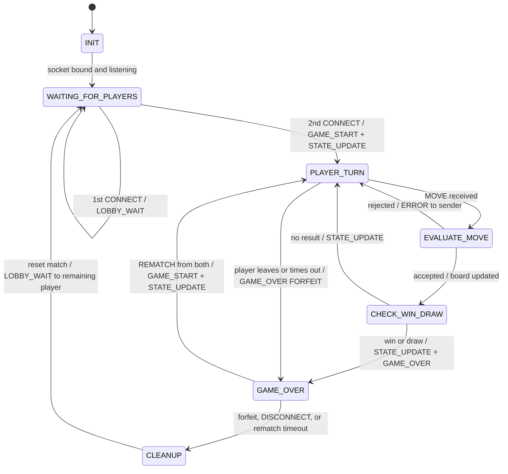

# Tic-Tac-Toe Application Protocol Blueprint

| | |
|---|---|
| **Project** | CS 457 Networked Tic-Tac-Toe |
| **Author** | Evan Lira |
| **Protocol version** | 1.0 |
| **Last updated** | 2026-10-04 |
| **Transport** | TCP (one long-lived connection per client) |
| **Serialization** | JSON, UTF-8 |
| **Framing** | Option A: newline-delimited JSON (`\n`, byte `0x0A`) |
| **SOW reference** | §2 Application-Layer Messaging Protocol Blueprint (Sprint 1) |

---

## Contents

1. [Protocol Overview](#1-protocol-overview)
2. [Framing Rule (Option A: Newline-Delimited JSON)](#2-framing-rule-option-a-newline-delimited-json)
3. [Common Message Envelope & Data Types](#3-common-message-envelope--data-types)
4. [Message Catalog](#4-message-catalog)
5. [Error Codes & Validation Order](#5-error-codes--validation-order)
6. [Session State Machine](#6-session-state-machine)
7. [Disconnect & Forfeit Management](#7-disconnect--forfeit-management)
8. [Wire Examples](#8-wire-examples)

---

## 1. Protocol Overview

- **Architecture:** client–server. One server hosts a single game room with exactly two player slots. Clients never talk to each other.
- **Server-authoritative:** the server owns the board, turn order, scores, and win/draw detection. Clients only send intents (`MOVE`, `REMATCH`, `DISCONNECT`) and render whatever the server sends in `STATE_UPDATE` and `GAME_OVER`. A client never updates its local board on its own.
- **Match vs. game:** a *match* is the series of games played by the same two players. Scores belong to the match and reset when a new opponent joins. A *game* is one board, from empty to win, draw, or forfeit.
- **Turn order (SOW §1.2):** the first player to connect is `X` and the second is `O` for the whole match. Who moves first in game 1 is random. After that it alternates every game.

### 1.1 Protocol Constants

| Constant | Value | Notes |
|---|---|---|
| `DEFAULT_PORT` | `5457/tcp` | Can be overridden on the command line; client connects to `server.lira.edu:5457` |
| `ENCODING` | UTF-8 | All bytes on the wire |
| `DELIMITER` | `0x0A` (`\n`) | Terminates every message |
| `MAX_FRAME_BYTES` | `4096` | Includes the trailing `\n`. The largest real message is about 240 bytes. |
| `PLAYER_ID_PATTERN` | `^[A-Za-z0-9_-]{1,16}$` | Player names |
| `SERVER_ID` | `"SERVER"` | Reserved `player_id` used on every server→client message |
| `TURN_TIMEOUT_S` | `60` | Active player must move within this window (§7.4) |
| `REMATCH_TIMEOUT_S` | `60` | Both players must answer within this window after `GAME_OVER` (§7.4) |

---

## 2. Framing Rule (Option A: Newline-Delimited JSON)

### 2.1 The Rule

> Every message is one JSON object, UTF-8 encoded, and terminated by exactly one newline character `\n` (`0x0A`). The receiver adds incoming bytes to a per-connection stream buffer until it sees a `\n`. It then takes out the complete line and deserializes it as one JSON object.

```
<frame>  ::= <json-object-utf8> 0x0A
<stream> ::= <frame>*
```

TCP is a byte stream, not a message stream. A single `recv()` can return part of one frame, exactly one frame, several frames, or the end of one frame plus the start of the next. The `\n` delimiter is the only message boundary. Message boundaries are **never** inferred from `recv()` call boundaries (see the segmentation examples in §8.4).

### 2.2 Sender Rules

1. Serialize with **compact** JSON on a single line: `json.dumps(msg, separators=(",", ":"))`.
   **Never** use `indent=`. Pretty-printing inserts raw newlines inside the object and breaks framing.
2. Encode to UTF-8 and append exactly one `b"\n"`.
3. If the resulting frame is larger than `MAX_FRAME_BYTES`, do not send it (this is a programming error).
4. Write with `sock.sendall(frame)`, not `send()`. `send()` may write only part of the buffer.
5. One message per frame. Never put two JSON objects on the same line or wrap several messages in an array.

### 2.3 Receiver Rules

1. Keep **one byte buffer per connection**. Never share a buffer between sockets.
2. Append every `recv()` chunk to the buffer.
3. While the buffer contains `0x0A`, split at the **first** `0x0A`. The bytes before it are one frame. The bytes after it stay in the buffer.
4. Strip any trailing `\r` from the frame (this tolerates CRLF from `nc`/`telnet` testing) and silently skip empty lines.
5. Decode the frame as UTF-8 and parse it as JSON. The result must be a JSON **object**. Otherwise the server answers `ERROR MALFORMED_JSON` (not fatal: the next `\n` still marks a valid boundary, so the stream stays in sync).
6. If a frame, or the unterminated data left in the buffer, reaches `MAX_FRAME_BYTES` without a `\n`, the receiver gives up on the stream. The server sends `ERROR FRAME_TOO_LARGE` (fatal) and closes the connection.
7. `recv()` returning `b""` means the peer closed the connection (EOF). Any bytes still in the buffer are a **truncated frame**. They are discarded and never processed.

### 2.4 Why `\n` Framing Is Safe

- **JSON escapes newlines inside strings.** The JSON grammar does not allow raw control characters (U+0000–U+001F, including LF) inside strings, so they must be escaped. A line break inside a `reason` string goes on the wire as the two characters `\` `n` (bytes `0x5C 0x6E`), never as a raw `0x0A`. A compact encoder therefore never emits a raw `0x0A` inside a message.
- **UTF-8 never hides `0x0A` inside a multi-byte character.** Every byte of a multi-byte UTF-8 sequence is `≥ 0x80`, so a `0x0A` byte always means LF. Splitting on raw bytes *before* decoding is safe.
- **No whitespace between tokens.** Compact separators mean the only `0x0A` in a correctly formed stream is the delimiter.

### 2.5 Reference Implementation (Python)

```python
import json
import socket

DELIMITER = b"\n"           # 0x0A
MAX_FRAME_BYTES = 4096      # includes the trailing delimiter


class FrameTooLarge(Exception):
    pass


def encode_frame(msg: dict) -> bytes:
    """Serialize one message dict into exactly one wire frame."""
    frame = json.dumps(msg, separators=(",", ":")).encode("utf-8") + DELIMITER
    if len(frame) > MAX_FRAME_BYTES:
        raise FrameTooLarge(len(frame))
    return frame


def send_msg(sock: socket.socket, msg: dict) -> None:
    sock.sendall(encode_frame(msg))  # sendall: never assume one send() == one frame


class FrameReader:
    """Accumulates recv() bytes and returns every complete line received so far."""

    def __init__(self):
        self.buffer = b""

    def feed(self, data: bytes) -> list[bytes]:
        self.buffer += data
        lines = []
        while DELIMITER in self.buffer:
            line, _, self.buffer = self.buffer.partition(DELIMITER)
            if len(line) + 1 > MAX_FRAME_BYTES:
                raise FrameTooLarge(len(line) + 1)
            line = line.rstrip(b"\r")    # tolerate CRLF from nc/telnet testing
            if line:                     # skip blank lines
                lines.append(line)
        if len(self.buffer) >= MAX_FRAME_BYTES:  # no delimiter within the limit
            raise FrameTooLarge(len(self.buffer))
        return lines
```

Typical receive loop:

```python
reader = FrameReader()
while True:
    data = sock.recv(4096)
    if not data:                      # EOF: peer closed (see §7)
        break
    for line in reader.feed(data):    # may yield 0, 1, or many frames
        msg = json.loads(line.decode("utf-8"))
        handle(msg)
```

---

## 3. Common Message Envelope & Data Types

### 3.1 Envelope

Every message, in both directions, is a JSON object with this top-level shape:

```json
{
  "msg_type": "MOVE",
  "player_id": "Player_1",
  "payload": {
    "row": 0,
    "col": 2
  },
  "timestamp": 1727000000
}
```

| Field | Type | Required | Description |
|---|---|---|---|
| `msg_type` | `string` | **Yes** | One of the nine types in §4. Uppercase and case-sensitive. |
| `player_id` | `PlayerId` or `"SERVER"` | **Yes** | Sender identity. Clients use their registered name. The server always uses `"SERVER"`. |
| `payload` | `object` | Conditional | Required when the message type defines required payload fields. It may be left out, or sent as `{}`, for types with no payload (`CONNECT`, `REMATCH`, client `DISCONNECT`). A missing payload is treated as `{}`. |
| `timestamp` | `integer` | **Yes** | Sender's Unix epoch time in whole seconds (UTC), e.g. `int(time.time())`. Informational and for logs only. It is **not** used for ordering (TCP already guarantees order) and it is **not** validated against the receiver's clock. |

### 3.2 Data Types

| Type | JSON encoding | Constraints |
|---|---|---|
| `string` | JSON string | UTF-8. Free-text fields (`message`, `reason`) are at most 128 characters. |
| `integer` | JSON number with no fraction or exponent | Python: validate with `type(v) is int`. `isinstance(v, int)` wrongly accepts `True`/`False`. |
| `boolean` | `true` / `false` | — |
| `null` | `null` | Used only where a field is listed as nullable |
| `PlayerId` | string | Matches `^[A-Za-z0-9_-]{1,16}$`. Must not equal `SERVER` (case-insensitive). Unique within the room. |
| `Symbol` | string | `"X"` or `"O"` |
| `Cell` | string | `"X"`, `"O"`, or `""` (empty) |
| `Board` | array of 3 arrays of 3 `Cell` | Indexed as `board[row][col]` |
| `Coord` | array of 2 integers | `[row, col]`, each 0–2 |

### 3.3 Board Coordinates

Row 0 is the top and column 0 is the left:

```
            col 0    col 1    col 2
          +--------+--------+--------+
  row 0   | [0][0] | [0][1] | [0][2] |
          +--------+--------+--------+
  row 1   | [1][0] | [1][1] | [1][2] |
          +--------+--------+--------+
  row 2   | [2][0] | [2][1] | [2][2] |
          +--------+--------+--------+
```

### 3.4 General Rules

- **Unknown fields are ignored**, at the top level and inside `payload`. This allows forward-compatible additions.
- **Field order is not significant.** JSON objects are unordered. The examples use `msg_type, player_id, payload, timestamp` for readability.
- **Identity comes from the socket, not the message.** At `CONNECT` the server binds a `player_id` to the socket. Every later message on that socket must carry the same `player_id`, otherwise the server replies `ERROR PLAYER_ID_MISMATCH` and ignores the message. A client cannot act as the other player by changing the field.
- **Clients never send `ERROR`.** If a client receives a line it cannot parse, or a `msg_type` it does not know, it logs it and ignores it.

---

## 4. Message Catalog

| # | `msg_type` | Direction | Delivery | Purpose |
|---|---|---|---|---|
| 1 | `CONNECT` | Client → Server | — | Join the room with a chosen `player_id` |
| 2 | `LOBBY_WAIT` | Server → Client | Unicast | Registered and waiting for an opponent |
| 3 | `GAME_START` | Server → Client | Unicast to each player | New game begins: symbols, first turn, scores |
| 4 | `MOVE` | Client → Server | — | Place your symbol at (`row`, `col`) |
| 5 | `STATE_UPDATE` | Server → Client | Broadcast (identical bytes to both) | Authoritative board and whose turn it is |
| 6 | `GAME_OVER` | Server → Client | Broadcast to remaining players | Win, draw, or forfeit, with updated scores |
| 7 | `REMATCH` | Client → Server | — | Ask to play another game against the same opponent |
| 8 | `DISCONNECT` | **Both directions** | Unicast | Graceful leave (client) or forced removal (server) |
| 9 | `ERROR` | Server → Client | Unicast to offender | Rejected message, invalid move, or protocol violation |

> `REMATCH` and `DISCONNECT` are added to the seven types in the SOW. `REMATCH` supports the "following games are alternated" rule in SOW §1.2. `DISCONNECT` supports forfeit management (§7).

The examples below are pretty-printed for readability. **On the wire, every message is compact and on a single line** (see §8).

---

### 4.1 `CONNECT` (Client → Server)

Sent once, as the first message after the TCP connection opens, to register in the room.

| Field | Type | Required | Description |
|---|---|---|---|
| `player_id` *(envelope)* | `PlayerId` | Yes | The name the client wants to use |
| `payload` | — | No | No payload fields |

```json
{"msg_type": "CONNECT", "player_id": "Alice", "timestamp": 1727000000}
```

**Server response:**

| Condition | Response |
|---|---|
| First player in an empty room | `LOBBY_WAIT` to the sender |
| Second player | `GAME_START` to each player, followed by `STATE_UPDATE` to both |
| Name fails `PLAYER_ID_PATTERN` or is `SERVER` | `ERROR INVALID_NAME` (not fatal; the client may send `CONNECT` again) |
| Name already used by the other player | `ERROR NAME_TAKEN` (not fatal; the client may send `CONNECT` again) |
| Two players already registered | `ERROR ROOM_FULL` (**fatal**; the connection is closed) |

---

### 4.2 `LOBBY_WAIT` (Server → Client)

Tells a registered player that they are waiting for an opponent. Sent (a) after the first player's successful `CONNECT`, and (b) to the remaining player after their opponent leaves (§7.2).

| Field | Type | Required | Constraints | Description |
|---|---|---|---|---|
| `players_connected` | `integer` | Yes | `1` | Registered players in the room, including the recipient |
| `players_required` | `integer` | Yes | `2` | Players needed to start |
| `message` | `string` | Yes | ≤ 128 chars | Status text to show the user |

```json
{
  "msg_type": "LOBBY_WAIT",
  "player_id": "SERVER",
  "payload": {
    "players_connected": 1,
    "players_required": 2,
    "message": "Waiting for an opponent..."
  },
  "timestamp": 1727000000
}
```

---

### 4.3 `GAME_START` (Server → Client)

Sent to **each** player separately, because `your_symbol` is different for each recipient. Sent when the second player registers (`game_number` = 1) and when both players send `REMATCH` (`game_number` + 1). The server **always** follows it immediately with a `STATE_UPDATE` (`move_number` = 0), so clients have one rendering path.

| Field | Type | Required | Constraints | Description |
|---|---|---|---|---|
| `game_number` | `integer` | Yes | ≥ 1 | 1 for the first game of a match, +1 per rematch |
| `players` | `object` | Yes | `{"X": PlayerId, "O": PlayerId}` | Symbol assignment, fixed for the whole match |
| `your_symbol` | `Symbol` | Yes | `"X"` or `"O"` | The recipient's symbol |
| `first_turn` | `PlayerId` | Yes | One of the two players | Who moves first this game. Random for game 1, then alternates. |
| `scores` | `object` | Yes | `PlayerId → integer ≥ 0` | Match wins **before** this game |
| `draws` | `integer` | Yes | ≥ 0 | Match draws before this game |
| `turn_timeout_s` | `integer` | Yes | ≥ 0 (`0` = disabled) | Seconds allowed per turn (§7.4) |

```json
{
  "msg_type": "GAME_START",
  "player_id": "SERVER",
  "payload": {
    "game_number": 1,
    "players": {"X": "Alice", "O": "Bob"},
    "your_symbol": "X",
    "first_turn": "Alice",
    "scores": {"Alice": 0, "Bob": 0},
    "draws": 0,
    "turn_timeout_s": 60
  },
  "timestamp": 1727000010
}
```

---

### 4.4 `MOVE` (Client → Server)

Asks the server to place the sender's symbol on a cell. Only valid while a game is in progress and only from the player named in the latest `STATE_UPDATE.current_turn`.

| Field | Type | Required | Constraints | Description |
|---|---|---|---|---|
| `row` | `integer` | Yes | 0–2 | Board row (0 = top) |
| `col` | `integer` | Yes | 0–2 | Board column (0 = left) |

```json
{
  "msg_type": "MOVE",
  "player_id": "Player_1",
  "payload": {
    "row": 0,
    "col": 2
  },
  "timestamp": 1727000000
}
```

**Server response:**
- **Accepted:** a `STATE_UPDATE` broadcast to both players. If the move ends the game, a `GAME_OVER` broadcast follows.
- **Rejected:** an `ERROR` to the sender only (validation order in §5.2). The board and turn do not change, and it is still the sender's turn.

---

### 4.5 `STATE_UPDATE` (Server → Client, broadcast)

The authoritative game state. Both players receive identical bytes. Sent after `GAME_START` and after every accepted `MOVE`.

| Field | Type | Required | Constraints | Description |
|---|---|---|---|---|
| `board` | `Board` | Yes | 3×3 of `"X"`, `"O"`, `""` | Full board, sent every time (never a diff) |
| `current_turn` | `PlayerId` or `null` | Yes | — | Who must move next. `null` after the game-ending move. |
| `move_number` | `integer` | Yes | 0–9 | Moves played so far in this game |
| `last_move` | `object` or `null` | Yes | — | The move that produced this state. `null` when `move_number` = 0. |
| `last_move.player_id` | `PlayerId` | Yes* | — | Who moved |
| `last_move.symbol` | `Symbol` | Yes* | — | Symbol placed |
| `last_move.row` | `integer` | Yes* | 0–2 | — |
| `last_move.col` | `integer` | Yes* | 0–2 | — |

<sub>* Required when `last_move` is not `null`.</sub>

```json
{
  "msg_type": "STATE_UPDATE",
  "player_id": "SERVER",
  "payload": {
    "board": [["X", "O", ""],
              ["",  "X", ""],
              ["",  "",  ""]],
    "current_turn": "Bob",
    "move_number": 3,
    "last_move": {"player_id": "Alice", "symbol": "X", "row": 0, "col": 0}
  },
  "timestamp": 1727000025
}
```

---

### 4.6 `GAME_OVER` (Server → Client, broadcast)

Reports the end of a game. After a winning or drawing move, it always comes **right after** the final `STATE_UPDATE` (the one with `current_turn: null`). After a forfeit, it is sent only to the remaining player and the board is not resent.

| Field | Type | Required | Constraints | Description |
|---|---|---|---|---|
| `result` | `string` | Yes | `"WIN"`, `"DRAW"`, `"FORFEIT"` | How the game ended |
| `winner` | `PlayerId` or `null` | Yes | `null` only for `DRAW` | Winner. For `FORFEIT`, the player who stayed. |
| `winning_line` | array of 3 `Coord`, or `null` | Yes | Non-null only for `WIN` | The three winning cells, ordered by row and then column |
| `forfeit_reason` | `string` or `null` | Yes | Non-null only for `FORFEIT`: `"DISCONNECT"`, `"CONNECTION_LOST"`, `"TIMEOUT"` | Why the opponent forfeited (§7.1) |
| `scores` | `object` | Yes | `PlayerId → integer` | Match wins **including** this game |
| `draws` | `integer` | Yes | ≥ 0 | Match draws including this game |
| `rematch_allowed` | `boolean` | Yes | — | `true` for `WIN`/`DRAW`. `false` for `FORFEIT`, because the opponent is gone. |

**Scoring:** `WIN`: winner +1. `DRAW`: `draws` +1. `FORFEIT`: the remaining player +1.
**Determinism:** if one move completes two lines at once, the server reports the first one found in this check order: rows 0→2, columns 0→2, main diagonal, anti-diagonal.

```json
{
  "msg_type": "GAME_OVER",
  "player_id": "SERVER",
  "payload": {
    "result": "WIN",
    "winner": "Alice",
    "winning_line": [[0, 0], [1, 1], [2, 2]],
    "forfeit_reason": null,
    "scores": {"Alice": 1, "Bob": 0},
    "draws": 0,
    "rematch_allowed": true
  },
  "timestamp": 1727000035
}
```

---

### 4.7 `REMATCH` (Client → Server)

Sent after a `GAME_OVER` with `rematch_allowed: true` to ask for another game against the same opponent. When **both** players have sent it, the server starts the next game (`GAME_START` + `STATE_UPDATE`) with `first_turn` switched to the other player. A duplicate `REMATCH` from the same player is ignored. To **decline**, the client sends `DISCONNECT`.

| Field | Type | Required | Description |
|---|---|---|---|
| `payload` | — | No | No payload fields |

```json
{"msg_type": "REMATCH", "player_id": "Bob", "timestamp": 1727000039}
```

---

### 4.8 `DISCONNECT` (Both Directions)

**Client → Server:** "I am leaving." After sending it, the client closes its socket. If it is sent while a game is in progress, it is a **forfeit** (§7). If it is sent after `GAME_OVER`, it declines the rematch.

**Server → Client:** "You are being removed." Sent before the server closes a connection for a reason that is not a protocol error: turn timeout, rematch timeout, or server shutdown. When the client receives it, it shows `reason` to the user and closes its socket. (Protocol errors use `ERROR` with `fatal: true` instead.)

| Field | Type | Required | Constraints | Description |
|---|---|---|---|---|
| `reason` | `string` | Client: optional. Server: **required**. | ≤ 128 chars | Readable explanation |

```json
{"msg_type": "DISCONNECT", "player_id": "Bob", "payload": {"reason": "Player quit"}, "timestamp": 1727000032}
```

```json
{"msg_type": "DISCONNECT", "player_id": "SERVER", "payload": {"reason": "Turn timeout (60 s)"}, "timestamp": 1727000085}
```

---

### 4.9 `ERROR` (Server → Client)

Sent only to the client whose message was rejected. Never broadcast.

| Field | Type | Required | Constraints | Description |
|---|---|---|---|---|
| `code` | `string` | Yes | One of the codes in §5.1 | Machine-readable reason |
| `message` | `string` | Yes | ≤ 128 chars | Text to show the user |
| `ref_msg_type` | `string` or `null` | Yes | — | `msg_type` of the rejected message, or `null` if it could not be parsed |
| `fatal` | `boolean` | Yes | — | `true` means the server closes this connection right after sending |

```json
{
  "msg_type": "ERROR",
  "player_id": "SERVER",
  "payload": {
    "code": "NOT_YOUR_TURN",
    "message": "It is Alice's turn.",
    "ref_msg_type": "MOVE",
    "fatal": false
  },
  "timestamp": 1727000012
}
```

---

## 5. Error Codes & Validation Order

### 5.1 Error Codes

| `code` | Fatal | Trigger |
|---|---|---|
| `MALFORMED_JSON` | No | Line is not valid UTF-8 or JSON, or is not a JSON object |
| `FRAME_TOO_LARGE` | **Yes** | `MAX_FRAME_BYTES` reached without a `\n` |
| `UNKNOWN_MSG_TYPE` | No | `msg_type` is missing from the catalog, or is a server→client type sent by a client |
| `INVALID_FIELD` | No | A required field is missing or has the wrong type (e.g. `"row": "1"`) |
| `PLAYER_ID_MISMATCH` | No | Envelope `player_id` is not the name registered to this socket |
| `INVALID_NAME` | No | `CONNECT` name fails `PLAYER_ID_PATTERN` or is `SERVER` |
| `NAME_TAKEN` | No | `CONNECT` name is already used by the other player |
| `ROOM_FULL` | **Yes** | `CONNECT` when two players are already registered |
| `UNEXPECTED_MESSAGE` | No | Valid message that is not allowed in the current state (see §6.2) |
| `NOT_YOUR_TURN` | No | `MOVE` from the player who is not `current_turn` |
| `OUT_OF_BOUNDS` | No | `row` or `col` is not in 0–2 |
| `CELL_OCCUPIED` | No | Target cell is not `""` |

After a fatal error the server closes the socket. If that player was in a game, this counts as a forfeit (`CONNECTION_LOST`, §7).

### 5.2 Validation Order for an Incoming Message

The server applies these checks in order and stops at the first failure:

1. Frame decodes as a JSON object → `MALFORMED_JSON`
2. `msg_type` is a known client→server type → `UNKNOWN_MSG_TYPE`
3. Envelope fields are present and correctly typed → `INVALID_FIELD`
4. `player_id` matches the socket's registered name (skipped before `CONNECT`) → `PLAYER_ID_MISMATCH`
5. Message is allowed in the current state (§6.2) → `UNEXPECTED_MESSAGE`
6. Payload fields are present and correctly typed → `INVALID_FIELD`
7. *(MOVE only)* Sender is `current_turn` → `NOT_YOUR_TURN`
8. *(MOVE only)* `0 ≤ row ≤ 2` and `0 ≤ col ≤ 2` → `OUT_OF_BOUNDS`
9. *(MOVE only)* `board[row][col] == ""` → `CELL_OCCUPIED`
10. Apply the move, check for a win or draw, then broadcast `STATE_UPDATE` (and `GAME_OVER` if the game ended)

---

## 6. Session State Machine

### 6.1 Room States (SOW §2.3)



`EVALUATE_MOVE` and `CHECK_WIN_DRAW` are internal steps that pass immediately. While the game is in progress, the room is waiting in `PLAYER_TURN`. A server shutdown can happen in any state (§7.2).

### 6.2 Allowed Client Messages per State

| Client sends | Socket not yet registered | `WAITING_FOR_PLAYERS` (in lobby) | `PLAYER_TURN` (game running) | `GAME_OVER` (awaiting rematch) |
|---|---|---|---|---|
| `CONNECT` | Register, or `INVALID_NAME` / `NAME_TAKEN` / `ROOM_FULL` | `UNEXPECTED_MESSAGE` | `UNEXPECTED_MESSAGE` | `UNEXPECTED_MESSAGE` |
| `MOVE` | `UNEXPECTED_MESSAGE` | `UNEXPECTED_MESSAGE` | Validate (§5.2) | `UNEXPECTED_MESSAGE` |
| `REMATCH` | `UNEXPECTED_MESSAGE` | `UNEXPECTED_MESSAGE` | `UNEXPECTED_MESSAGE` | Record it. Start the next game once both have sent it. |
| `DISCONNECT` | Close socket | Remove player; room is empty | **Forfeit** (§7) | Remove player; opponent goes back to the lobby |

### 6.3 Server Send-Order Guarantees

1. `GAME_START` is always followed immediately by `STATE_UPDATE` with `move_number: 0`.
2. A game-ending move produces `STATE_UPDATE` (`current_turn: null`) and then `GAME_OVER`, in that order.
3. A forfeit produces `GAME_OVER` (`FORFEIT`) and then `LOBBY_WAIT`, sent to the remaining player.
4. Broadcasts are sent to both players while holding the game lock, so both players see the same sequence of states.

---

## 7. Disconnect & Forfeit Management

### 7.1 How a Departure Is Detected

| # | Trigger | How the server sees it | `forfeit_reason` |
|---|---|---|---|
| 1 | Graceful quit | A `DISCONNECT` message arrives | `"DISCONNECT"` |
| 2 | Orderly TCP close (process exits, socket closed) | `recv()` returns `b""` (FIN) | `"CONNECTION_LOST"` |
| 3 | Abrupt TCP failure | `recv()`/`sendall()` raises `ConnectionResetError`, `BrokenPipeError`, or another `OSError` (RST) | `"CONNECTION_LOST"` |
| 4 | Fatal protocol error | Server sends `ERROR` with `fatal: true` and closes the socket | `"CONNECTION_LOST"` |
| 5 | Silent peer (CML node powered off, link down, client hung) | `TURN_TIMEOUT_S` expires with no valid `MOVE` from the active player | `"TIMEOUT"` |

Trigger 5 is needed because TCP sends nothing when a host disappears without sending FIN or RST. Without an application-level timer, the server would wait forever for that player's move.

### 7.2 Server Action by State

When player **P** leaves (for any reason in §7.1) and **Q** is the opponent:

| Room state when P leaves | Messages to Q | Scores | Next room state |
|---|---|---|---|
| Socket not yet registered | none | — | unchanged |
| `WAITING_FOR_PLAYERS` (P alone in lobby) | none | — | `WAITING_FOR_PLAYERS` (empty) |
| `PLAYER_TURN`: game running, **either player's turn** | `GAME_OVER` `{result: FORFEIT, winner: Q, forfeit_reason}` and then `LOBBY_WAIT` | Q +1 (shown in that `GAME_OVER`) | `CLEANUP` → `WAITING_FOR_PLAYERS` with Q as `X` for the next match |
| `GAME_OVER` (awaiting rematch) | `LOBBY_WAIT` only. This is **not** a forfeit because the game already ended. | unchanged | `CLEANUP` → `WAITING_FOR_PLAYERS` |
| Server shutdown (any state) | `DISCONNECT {reason: "Server shutting down"}` to every registered player, then close | — | terminated |

In every case the server stops sending to P, closes P's socket, and frees P's `player_id`. When a new opponent joins, a new match starts with `game_number` 1 and scores at 0.

### 7.3 Graceful Exit Procedure

**Client quitting (e.g. user types `quit` or presses Ctrl-C):**
1. Send `DISCONNECT` (optionally with a `reason`).
2. Close the socket. Do not wait for a reply. The server sends nothing back to a client that has disconnected.

**Server removing a client (timeout, shutdown):**
1. Send `DISCONNECT` (or `ERROR` with `fatal: true`) using `sendall()`.
2. Call `sock.shutdown(socket.SHUT_WR)` and then `close()`. This sends FIN after the final message, so the client can read it before it sees EOF.

### 7.4 Timeouts

| Timer | Starts | Reset by | On expiry |
|---|---|---|---|
| `TURN_TIMEOUT_S` (60 s) | When a `STATE_UPDATE` names a player in `current_turn` | Only an **accepted** `MOVE`. Rejected moves do not reset it. | Server sends `DISCONNECT {reason: "Turn timeout (60 s)"}` to the active player and closes their socket. Opponent gets `GAME_OVER FORFEIT (TIMEOUT)` and then `LOBBY_WAIT`. |
| `REMATCH_TIMEOUT_S` (60 s) | When `GAME_OVER` with `rematch_allowed: true` is sent | — | Any player who has not sent `REMATCH` gets `DISCONNECT {reason: "Rematch timeout"}` and is closed. A player who did send `REMATCH` gets `LOBBY_WAIT`. |

`turn_timeout_s` is sent in `GAME_START` so clients can show a countdown. A value of `0` turns the timer off (useful for debugging).

### 7.5 Concurrency & Races

- All state changes (moves, forfeits, rematch votes, timer expiry) happen while holding **one game lock**. Events are handled one at a time, in the order they acquire the lock.
- **Move vs. disconnect race:** if P's winning `MOVE` is handled first, the game ends as `WIN`. P's later EOF then happens in `GAME_OVER`, so it is not a forfeit. If the EOF is handled first, P forfeits and any later bytes from P are never read.
- **Both players leave together:** the first departure handled produces the forfeit. By the time the second one is handled, the room is in `CLEANUP`/`WAITING_FOR_PLAYERS`, so nothing more is sent (there is no one to send to). The room resets to empty.
- **Truncated frame at EOF:** if P's process dies in the middle of a `MOVE` (some bytes received, no `\n`), the partial frame is discarded (§2.3 rule 7). Only complete frames are ever acted on.

### 7.6 Client-Side Handling of Server Loss

If the client's `recv()` returns `b""` or raises `ConnectionResetError`, the client tells the user "Connection to server lost" and exits cleanly. It does not attempt any game logic locally. Clients need no timers of their own.

---

## 8. Wire Examples

### 8.1 Notation

- In the wire streams below, `\n` stands for the **single byte `0x0A`**, not the two characters `\` and `n`.
- `C1` = Alice's client, `C2` = Bob's client, `S` = server. `S → C1,C2` means the same bytes are sent to both sockets.
- Transcripts list each frame on its own line for readability. The leading `C1 → S` label is **not** on the wire, and each line is followed by `0x0A`.

### 8.2 Continuous Stream (Client → Server)

Two messages written to one socket, exactly as they appear on the wire:

```
{"msg_type":"CONNECT","player_id":"Alice","timestamp":1727000000}\n{"msg_type":"MOVE","player_id":"Alice","payload":{"row":0,"col":2},"timestamp":1727000005}\n
```

Frame 1 is 66 bytes (65 bytes of JSON + `\n`). Frame 2 is 91 bytes (90 bytes of JSON + `\n`). The stream is 157 bytes in total.

### 8.3 Byte-Level View (`xxd`)

The same 157 bytes. The two `0a` bytes, at offsets `0x41` and `0x9c`, are the only frame boundaries:

```
00000000: 7b22 6d73 675f 7479 7065 223a 2243 4f4e  {"msg_type":"CON
00000010: 4e45 4354 222c 2270 6c61 7965 725f 6964  NECT","player_id
00000020: 223a 2241 6c69 6365 222c 2274 696d 6573  ":"Alice","times
00000030: 7461 6d70 223a 3137 3237 3030 3030 3030  tamp":1727000000
00000040: 7d0a 7b22 6d73 675f 7479 7065 223a 224d  }.{"msg_type":"M
            ^^ 0x41 = 0x0A  ← end of frame 1
00000050: 4f56 4522 2c22 706c 6179 6572 5f69 6422  OVE","player_id"
00000060: 3a22 416c 6963 6522 2c22 7061 796c 6f61  :"Alice","payloa
00000070: 6422 3a7b 2272 6f77 223a 302c 2263 6f6c  d":{"row":0,"col
00000080: 223a 327d 2c22 7469 6d65 7374 616d 7022  ":2},"timestamp"
00000090: 3a31 3732 3730 3030 3030 357d 0a         :1727000005}.
                                        ^^ 0x9c = 0x0A  ← end of frame 2
```

### 8.4 TCP Segmentation: How the Receiver Buffer Evolves

The same 157-byte stream can reach the server split up in different ways. The `FrameReader` (§2.5) produces the same two messages every time.

**Case A: coalesced (both frames in one `recv()`)**

| `recv()` | Bytes received | Frames extracted | Buffer after |
|---|---|---|---|
| #1 | all 157 bytes | `CONNECT`, `MOVE` | *(empty)* |

**Case B: one frame split across two `recv()` calls**

| `recv()` | Bytes received | Frames extracted | Buffer after |
|---|---|---|---|
| #1 | `{"msg_type":"CONNECT","player_id":"Alice` (40 B) | none (no `\n` yet) | `{"msg_type":"CONNECT","player_id":"Alice` |
| #2 | `","timestamp":1727000000}\n{"msg_type":"MOVE",…}\n` (117 B) | `CONNECT`, `MOVE` | *(empty)* |

**Case C: one and a half frames**

| `recv()` | Bytes received | Frames extracted | Buffer after |
|---|---|---|---|
| #1 | `{"msg_type":"CONNECT",…,"timestamp":1727000000}\n{"msg_type":"MOVE","player_id"` (96 B) | `CONNECT` | `{"msg_type":"MOVE","player_id"` |
| #2 | `:"Alice","payload":{"row":0,"col":2},"timestamp":1727000005}\n` (61 B) | `MOVE` | *(empty)* |

**Case D: one byte per `recv()` (worst case)**: 157 calls. Calls 1–65 and 67–156 extract nothing. Call 66 extracts `CONNECT` and call 157 extracts `MOVE`.

### 8.5 Full Session Transcript

Alice connects, Bob joins, Alice wins game 1 on the diagonal, both ask for a rematch, and game 2 starts with Bob moving first.

```
C1 → S     {"msg_type":"CONNECT","player_id":"Alice","timestamp":1727000000}
S → C1     {"msg_type":"LOBBY_WAIT","player_id":"SERVER","payload":{"players_connected":1,"players_required":2,"message":"Waiting for an opponent..."},"timestamp":1727000000}
C2 → S     {"msg_type":"CONNECT","player_id":"Bob","timestamp":1727000010}
S → C1     {"msg_type":"GAME_START","player_id":"SERVER","payload":{"game_number":1,"players":{"X":"Alice","O":"Bob"},"your_symbol":"X","first_turn":"Alice","scores":{"Alice":0,"Bob":0},"draws":0,"turn_timeout_s":60},"timestamp":1727000010}
S → C2     {"msg_type":"GAME_START","player_id":"SERVER","payload":{"game_number":1,"players":{"X":"Alice","O":"Bob"},"your_symbol":"O","first_turn":"Alice","scores":{"Alice":0,"Bob":0},"draws":0,"turn_timeout_s":60},"timestamp":1727000010}
S → C1,C2  {"msg_type":"STATE_UPDATE","player_id":"SERVER","payload":{"board":[["","",""],["","",""],["","",""]],"current_turn":"Alice","move_number":0,"last_move":null},"timestamp":1727000010}
C1 → S     {"msg_type":"MOVE","player_id":"Alice","payload":{"row":1,"col":1},"timestamp":1727000015}
S → C1,C2  {"msg_type":"STATE_UPDATE","player_id":"SERVER","payload":{"board":[["","",""],["","X",""],["","",""]],"current_turn":"Bob","move_number":1,"last_move":{"player_id":"Alice","symbol":"X","row":1,"col":1}},"timestamp":1727000015}
C2 → S     {"msg_type":"MOVE","player_id":"Bob","payload":{"row":0,"col":1},"timestamp":1727000020}
S → C1,C2  {"msg_type":"STATE_UPDATE","player_id":"SERVER","payload":{"board":[["","O",""],["","X",""],["","",""]],"current_turn":"Alice","move_number":2,"last_move":{"player_id":"Bob","symbol":"O","row":0,"col":1}},"timestamp":1727000020}
C1 → S     {"msg_type":"MOVE","player_id":"Alice","payload":{"row":0,"col":0},"timestamp":1727000025}
S → C1,C2  {"msg_type":"STATE_UPDATE","player_id":"SERVER","payload":{"board":[["X","O",""],["","X",""],["","",""]],"current_turn":"Bob","move_number":3,"last_move":{"player_id":"Alice","symbol":"X","row":0,"col":0}},"timestamp":1727000025}
C2 → S     {"msg_type":"MOVE","player_id":"Bob","payload":{"row":0,"col":2},"timestamp":1727000030}
S → C1,C2  {"msg_type":"STATE_UPDATE","player_id":"SERVER","payload":{"board":[["X","O","O"],["","X",""],["","",""]],"current_turn":"Alice","move_number":4,"last_move":{"player_id":"Bob","symbol":"O","row":0,"col":2}},"timestamp":1727000030}
C1 → S     {"msg_type":"MOVE","player_id":"Alice","payload":{"row":2,"col":2},"timestamp":1727000035}
S → C1,C2  {"msg_type":"STATE_UPDATE","player_id":"SERVER","payload":{"board":[["X","O","O"],["","X",""],["","","X"]],"current_turn":null,"move_number":5,"last_move":{"player_id":"Alice","symbol":"X","row":2,"col":2}},"timestamp":1727000035}
S → C1,C2  {"msg_type":"GAME_OVER","player_id":"SERVER","payload":{"result":"WIN","winner":"Alice","winning_line":[[0,0],[1,1],[2,2]],"forfeit_reason":null,"scores":{"Alice":1,"Bob":0},"draws":0,"rematch_allowed":true},"timestamp":1727000035}
C2 → S     {"msg_type":"REMATCH","player_id":"Bob","timestamp":1727000039}
C1 → S     {"msg_type":"REMATCH","player_id":"Alice","timestamp":1727000041}
S → C1     {"msg_type":"GAME_START","player_id":"SERVER","payload":{"game_number":2,"players":{"X":"Alice","O":"Bob"},"your_symbol":"X","first_turn":"Bob","scores":{"Alice":1,"Bob":0},"draws":0,"turn_timeout_s":60},"timestamp":1727000041}
S → C2     {"msg_type":"GAME_START","player_id":"SERVER","payload":{"game_number":2,"players":{"X":"Alice","O":"Bob"},"your_symbol":"O","first_turn":"Bob","scores":{"Alice":1,"Bob":0},"draws":0,"turn_timeout_s":60},"timestamp":1727000041}
S → C1,C2  {"msg_type":"STATE_UPDATE","player_id":"SERVER","payload":{"board":[["","",""],["","",""],["","",""]],"current_turn":"Bob","move_number":0,"last_move":null},"timestamp":1727000041}
```

**What Alice's socket actually receives** between `t=1727000000` and `t=1727000010`, as one continuous server→client stream. `GAME_START` and `STATE_UPDATE` are sent back-to-back, so they often arrive together in a single `recv()`:

```
{"msg_type":"LOBBY_WAIT","player_id":"SERVER","payload":{"players_connected":1,"players_required":2,"message":"Waiting for an opponent..."},"timestamp":1727000000}\n{"msg_type":"GAME_START","player_id":"SERVER","payload":{"game_number":1,"players":{"X":"Alice","O":"Bob"},"your_symbol":"X","first_turn":"Alice","scores":{"Alice":0,"Bob":0},"draws":0,"turn_timeout_s":60},"timestamp":1727000010}\n{"msg_type":"STATE_UPDATE","player_id":"SERVER","payload":{"board":[["","",""],["","",""],["","",""]],"current_turn":"Alice","move_number":0,"last_move":null},"timestamp":1727000010}\n
```

### 8.6 Error Exchanges

**Name collision at `CONNECT` (not fatal, client retries):**

```
C2 → S     {"msg_type":"CONNECT","player_id":"Alice","timestamp":1727000008}
S → C2     {"msg_type":"ERROR","player_id":"SERVER","payload":{"code":"NAME_TAKEN","message":"player_id 'Alice' is already in use.","ref_msg_type":"CONNECT","fatal":false},"timestamp":1727000008}
C2 → S     {"msg_type":"CONNECT","player_id":"Bob","timestamp":1727000010}
```

**Moving out of turn** (it is Alice's turn, `move_number` 0):

```
C2 → S     {"msg_type":"MOVE","player_id":"Bob","payload":{"row":0,"col":0},"timestamp":1727000012}
S → C2     {"msg_type":"ERROR","player_id":"SERVER","payload":{"code":"NOT_YOUR_TURN","message":"It is Alice's turn.","ref_msg_type":"MOVE","fatal":false},"timestamp":1727000012}
```

**Occupied cell, out-of-bounds cell, and wrong field type** (Bob's turn, center already taken):

```
C2 → S     {"msg_type":"MOVE","player_id":"Bob","payload":{"row":1,"col":1},"timestamp":1727000017}
S → C2     {"msg_type":"ERROR","player_id":"SERVER","payload":{"code":"CELL_OCCUPIED","message":"Cell (1,1) is already taken.","ref_msg_type":"MOVE","fatal":false},"timestamp":1727000017}
C2 → S     {"msg_type":"MOVE","player_id":"Bob","payload":{"row":3,"col":0},"timestamp":1727000018}
S → C2     {"msg_type":"ERROR","player_id":"SERVER","payload":{"code":"OUT_OF_BOUNDS","message":"row and col must be 0, 1, or 2.","ref_msg_type":"MOVE","fatal":false},"timestamp":1727000018}
C2 → S     {"msg_type":"MOVE","player_id":"Bob","payload":{"row":"0","col":1},"timestamp":1727000019}
S → C2     {"msg_type":"ERROR","player_id":"SERVER","payload":{"code":"INVALID_FIELD","message":"payload.row must be an integer.","ref_msg_type":"MOVE","fatal":false},"timestamp":1727000019}
```

**Impersonation attempt** (Bob's socket claims to be Alice):

```
C2 → S     {"msg_type":"MOVE","player_id":"Alice","payload":{"row":2,"col":0},"timestamp":1727000019}
S → C2     {"msg_type":"ERROR","player_id":"SERVER","payload":{"code":"PLAYER_ID_MISMATCH","message":"This connection is registered as 'Bob'.","ref_msg_type":"MOVE","fatal":false},"timestamp":1727000019}
```

**Malformed JSON.** The line is terminated, so framing stays in sync and the next frame is processed normally:

```
C2 → S     {"msg_type":"MOVE","player_id":"Bob","payload":{"row":0,
S → C2     {"msg_type":"ERROR","player_id":"SERVER","payload":{"code":"MALFORMED_JSON","message":"Line is not a valid JSON object.","ref_msg_type":null,"fatal":false},"timestamp":1727000019}
C2 → S     {"msg_type":"MOVE","player_id":"Bob","payload":{"row":0,"col":1},"timestamp":1727000020}
```

**Third client while a game is running (fatal):**

```
C3 → S     {"msg_type":"CONNECT","player_id":"Carol","timestamp":1727000022}
S → C3     {"msg_type":"ERROR","player_id":"SERVER","payload":{"code":"ROOM_FULL","message":"A game is already in progress.","ref_msg_type":"CONNECT","fatal":true},"timestamp":1727000022}
           [server: shutdown(SHUT_WR), close C3 socket]
```

**Oversized frame (fatal).** The client sends 4096+ bytes with no `\n`:

```
C2 → S     xxxxxxxxxxxxxxxxxxxxxxxxxxxxxxxxxxxx… (4096 bytes, no 0x0A)
S → C2     {"msg_type":"ERROR","player_id":"SERVER","payload":{"code":"FRAME_TOO_LARGE","message":"Frame exceeds 4096 bytes.","ref_msg_type":null,"fatal":true},"timestamp":1727000024}
           [server: close C2 socket. If a game is running, Alice wins by FORFEIT (CONNECTION_LOST), see §8.7]
```

### 8.7 Disconnect & Forfeit Exchanges

All scenarios below happen during **game 1** of the Alice-vs-Bob match (scores 0–0 before the forfeit).

**A. Graceful quit in the middle of a game (`forfeit_reason: DISCONNECT`):**

```
C2 → S     {"msg_type":"DISCONNECT","player_id":"Bob","payload":{"reason":"Player quit"},"timestamp":1727000032}
           [C2 closes its socket; server closes C2 socket]
S → C1     {"msg_type":"GAME_OVER","player_id":"SERVER","payload":{"result":"FORFEIT","winner":"Alice","winning_line":null,"forfeit_reason":"DISCONNECT","scores":{"Alice":1,"Bob":0},"draws":0,"rematch_allowed":false},"timestamp":1727000032}
S → C1     {"msg_type":"LOBBY_WAIT","player_id":"SERVER","payload":{"players_connected":1,"players_required":2,"message":"Bob left the match. Waiting for a new opponent..."},"timestamp":1727000032}
```

**B. Abrupt connection loss (`forfeit_reason: CONNECTION_LOST`).** It is Bob's turn (after Alice's move 3), and Bob's client crashes in the middle of sending a `MOVE`:

```
C2 → S     {"msg_type":"MOVE","player_id":"Bob","pay          ← partial frame, no 0x0A
           [TCP FIN or RST from C2: server recv() returns b"" or raises ConnectionResetError]
           [server discards the 41 buffered bytes, which are never parsed]
S → C1     {"msg_type":"GAME_OVER","player_id":"SERVER","payload":{"result":"FORFEIT","winner":"Alice","winning_line":null,"forfeit_reason":"CONNECTION_LOST","scores":{"Alice":1,"Bob":0},"draws":0,"rematch_allowed":false},"timestamp":1727000027}
S → C1     {"msg_type":"LOBBY_WAIT","player_id":"SERVER","payload":{"players_connected":1,"players_required":2,"message":"Bob left the match. Waiting for a new opponent..."},"timestamp":1727000027}
```

**C. Turn timeout (`forfeit_reason: TIMEOUT`).** Bob's turn started at `1727000025` (after Alice's move 3), and Bob's CML node goes silent:

```
           [t=1727000025 … 1727000085: no bytes from C2]
S → C2     {"msg_type":"DISCONNECT","player_id":"SERVER","payload":{"reason":"Turn timeout (60 s)"},"timestamp":1727000085}
           [server: shutdown(SHUT_WR), close C2 socket]
S → C1     {"msg_type":"GAME_OVER","player_id":"SERVER","payload":{"result":"FORFEIT","winner":"Alice","winning_line":null,"forfeit_reason":"TIMEOUT","scores":{"Alice":1,"Bob":0},"draws":0,"rematch_allowed":false},"timestamp":1727000085}
S → C1     {"msg_type":"LOBBY_WAIT","player_id":"SERVER","payload":{"players_connected":1,"players_required":2,"message":"Bob left the match. Waiting for a new opponent..."},"timestamp":1727000085}
```

**D. Leaving after the game ends (declining a rematch, which is not a forfeit).** Game 1 ended with Alice's win at `1727000035`:

```
C2 → S     {"msg_type":"DISCONNECT","player_id":"Bob","payload":{"reason":"Declined rematch"},"timestamp":1727000038}
S → C1     {"msg_type":"LOBBY_WAIT","player_id":"SERVER","payload":{"players_connected":1,"players_required":2,"message":"Bob left the match. Waiting for a new opponent..."},"timestamp":1727000038}
```

No `GAME_OVER` is sent and the scores do not change, because the game had already ended.

**E. Server shutdown:**

```
S → C1     {"msg_type":"DISCONNECT","player_id":"SERVER","payload":{"reason":"Server shutting down"},"timestamp":1727000099}
S → C2     {"msg_type":"DISCONNECT","player_id":"SERVER","payload":{"reason":"Server shutting down"},"timestamp":1727000099}
           [server closes both sockets and the listening socket]
```
